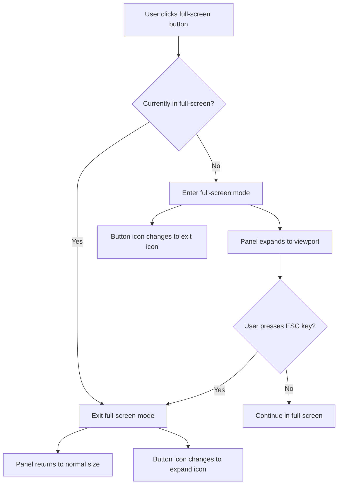
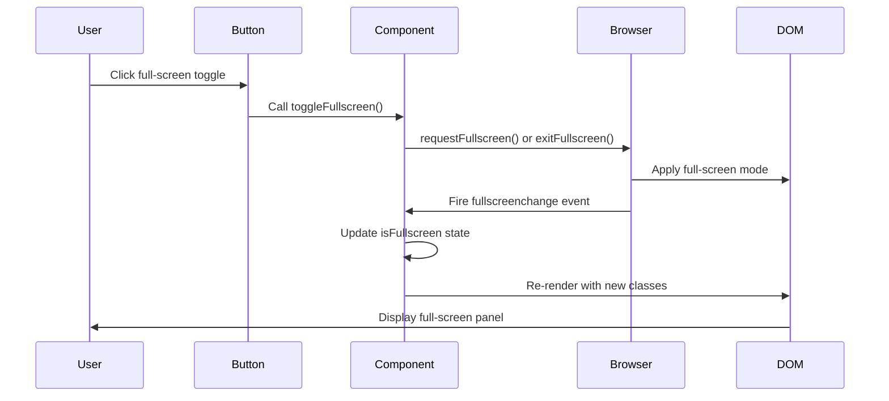

# Full-Screen Toggle for Right Side Panel Tabs

## Overview

Add a full-screen toggle button to all tabs in the right side panel, allowing users to expand any tab content (Design, Sim, Control, GRBL, Logs) to full-screen mode for improved visibility and focused work.

## Background

Currently, only the Simulator panel has full-screen functionality. Users working with other panels like Design, Machine Control, GRBL Settings, or Logs may benefit from a full-screen view to maximize workspace and reduce distractions, especially when:
- Editing complex shape properties in the Design panel
- Monitoring machine operations in the Control panel
- Reviewing extensive logs
- Analyzing GRBL settings

## Goals

- Provide consistent full-screen capability across all right side panel tabs
- Maintain visual and behavioral consistency with existing Simulator full-screen implementation
- Ensure seamless transition between normal and full-screen modes
- Preserve panel state and user interactions during mode transitions

## Feature Requirements

### Functional Requirements

| Requirement | Description |
|------------|-------------|
| Full-Screen Button | Add a full-screen toggle button to each panel's header (Design, Control, GRBL, Logs) |
| Full-Screen Mode | When activated, expand the panel to occupy the entire viewport |
| Exit Full-Screen | Provide multiple exit methods: button click, ESC key, browser's native full-screen exit |
| State Persistence | Maintain panel content, scroll position, and user inputs during mode transitions |
| Visual Feedback | Clearly indicate full-screen state through button icon change and visual styling |

### User Interaction Flow



### Technical Approach

#### State Management

Each panel component requires a full-screen state variable to track its mode:

| State Variable | Type | Purpose |
|---------------|------|---------|
| isFullscreen | boolean | Tracks whether the panel is in full-screen mode |

#### UI Components

| Component | Location | Modification |
|-----------|----------|--------------|
| PropertiesPanel | Header section | Add full-screen toggle button |
| MachineControl | Header section | Add full-screen toggle button |
| GrblSettingsPanel | Header section | Add full-screen toggle button |
| LogsPanel | Header section | Add full-screen toggle button |

#### Button Placement

The full-screen toggle button should be positioned:
- In the panel header, alongside existing action buttons
- Before the close button (X)
- Consistent with the Simulator panel's button placement pattern

#### Visual Design

| State | Icon | Title Text | Styling |
|-------|------|-----------|---------|
| Normal mode | Maximize2 | "Fullscreen" | Same as existing Simulator button styling |
| Full-screen mode | Minimize2 | "Exit Fullscreen" | Same as existing Simulator button styling |

Button styling specification:
- Base classes: `p-1.5 text-slate-400 hover:text-sky-400 bg-slate-700 rounded`
- Icon size: 16px
- Hover effect: Text color changes to sky-400

### Implementation Strategy

#### Step 1: Add Full-Screen State and Handlers

For each panel component:
- Add `isFullscreen` state variable using React useState
- Implement `toggleFullscreen` function utilizing the Fullscreen API
- Add event listener for `fullscreenchange` event to sync state with browser full-screen status

#### Step 2: Update Component Styling

Apply conditional styling based on full-screen state:
- When `isFullscreen` is true: Apply classes `fixed inset-0 z-[10000] w-screen h-screen`
- When `isFullscreen` is false: Maintain existing panel styling
- Ensure proper z-index layering to display above all other content

#### Step 3: Add Toggle Button to Header

Insert the full-screen button in each panel's header section:
- Position between other action buttons and the close button
- Use Maximize2 icon from lucide-react for expand action
- Use Minimize2 icon from lucide-react for exit action
- Include appropriate title attribute for tooltip

#### Step 4: Keyboard Support

Implement ESC key handler:
- The browser's native full-screen API automatically handles ESC key
- The `fullscreenchange` event listener will sync the component state when ESC is pressed
- No additional keyboard handler needed beyond the existing event listener

### Panel-Specific Considerations

#### Properties Panel

- Ensure scroll position is maintained when entering/exiting full-screen
- Canvas size and grid size controls should remain accessible
- Multi-selection state display should be visible

#### Machine Control Panel

- Jog controls and positioning interface must remain functional
- Connection status should be clearly visible
- Emergency stop and safety controls should be prominent

#### GRBL Settings Panel

- Search functionality must remain accessible
- Settings table should expand to use available space
- Scroll behavior should adapt to full viewport

#### Logs Panel

- Auto-scroll behavior should continue in full-screen mode
- Log filtering controls should remain visible
- Clear logs button should be accessible

### Browser Compatibility

The Fullscreen API has wide browser support:
- Chrome/Edge: Fully supported
- Firefox: Fully supported
- Safari: Supported with vendor prefix (webkit)

Handle potential errors:
- Wrap `requestFullscreen()` call in try-catch block
- Gracefully handle browsers that don't support the API
- Provide console error logging for debugging

### Edge Cases and Error Handling

| Scenario | Handling Strategy |
|----------|------------------|
| Browser lacks full-screen support | Hide the full-screen button or disable it with a tooltip explaining lack of support |
| Full-screen request fails | Log error to console, show no visual change to user |
| User switches tabs while in full-screen | Maintain full-screen state for the active panel |
| Multiple rapid clicks on toggle | Debounce or disable button during transition |

## User Experience Enhancements

### Visual Transitions

- Apply CSS transition classes for smooth enter/exit animations
- Use existing application transition duration patterns (e.g., `transition-all`)
- Maintain consistent timing with other panel animations

### Accessibility

| Aspect | Implementation |
|--------|----------------|
| Keyboard Navigation | Button should be focusable and activatable via Enter/Space |
| Screen Readers | Provide descriptive aria-labels for button state |
| Focus Management | Return focus to toggle button after exiting full-screen |

### Responsive Behavior

- Full-screen mode should work on mobile devices (though right panel behavior may differ)
- On small screens, full-screen toggle provides maximum benefit for content visibility
- Ensure touch interactions work as expected on mobile/tablet devices

## Technical Design Patterns

### Component Structure Template

Each panel should follow this pattern:

```
Panel Component
├── Full-screen state management
│   ├── isFullscreen state variable
│   ├── useEffect for fullscreenchange listener
│   └── toggleFullscreen handler function
├── Wrapper div with ref
│   ├── Conditional className based on isFullscreen
│   └── Full-screen styling applied when active
├── Header section
│   ├── Panel title
│   ├── Action buttons (existing)
│   ├── Full-screen toggle button (new)
│   └── Close button
└── Panel content
    └── Rendered normally regardless of full-screen state
```

### Event Flow Diagram



## Testing Considerations

### Manual Testing Checklist

| Test Case | Expected Result |
|-----------|----------------|
| Click full-screen button on each panel | Panel expands to full viewport |
| Press ESC while in full-screen | Panel returns to normal size |
| Click exit full-screen button | Panel returns to normal size |
| Switch between tabs in full-screen mode | Full-screen state persists for active panel |
| Enter full-screen on mobile device | Panel expands appropriately |
| Resize browser window in full-screen | Panel maintains full viewport coverage |
| Scroll content in full-screen mode | Scrolling works as expected |

### Cross-Browser Testing

Verify functionality in:
- Chrome/Edge (latest)
- Firefox (latest)
- Safari (latest)
- Mobile browsers (iOS Safari, Chrome Mobile)

## Future Enhancements

Potential improvements for future iterations:

| Enhancement | Description |
|------------|-------------|
| Remember user preference | Store full-screen preference per panel in localStorage |
| Keyboard shortcut | Add global shortcut (e.g., F11 or Ctrl+Shift+F) to toggle full-screen for active panel |
| Picture-in-picture mode | Allow panels to float in a resizable window (similar to existing Simulator floating mode) |
| Multi-monitor support | Detect and optimize for multiple displays |

## Design Decisions

### Why Full-Screen for All Panels?

- **Consistency**: Users expect similar functionality across related UI components
- **Flexibility**: Different workflows require focus on different panels
- **Accessibility**: Larger view improves readability and reduces eye strain
- **Complexity handling**: Technical panels (GRBL, Logs) often contain dense information

### Why Use Native Fullscreen API?

- **Browser integration**: Leverages browser's built-in full-screen capabilities
- **ESC key handling**: Automatic support for standard exit mechanism
- **Performance**: No custom positioning/sizing calculations needed
- **Proven pattern**: Already successfully implemented in Simulator panel

### Button Placement Rationale

Position in header before close button because:
- **Visibility**: Users naturally look at header for view options
- **Consistency**: Matches existing Simulator panel pattern
- **Accessibility**: Easy to reach with mouse and keyboard
- **Logical flow**: View controls before dismissal actions
